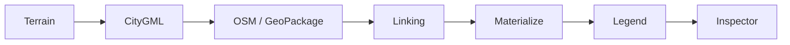

# Diagrams

This index tracks visual references used by the add-on documentation.

## Pipeline (Mermaid)

- Exported SVG: [Images/pipeline.svg](Images/pipeline.svg)

## Primary Diagram

- [CityGML-OSM-LINK.png](Images/CityGML-OSM-LINK.png)
  - High-level visual overview of the CityGML/OSM linking concept.

## Graphical Abstract Concept (1080x1080)

- [Images/graphical_abstract.svg](Images/graphical_abstract.svg)
  - Square (1080x1080), minimal layout.
  - Shows CityGML (3D blocks), OSM (2D layer), Blender as integration background, and linking arrows.
  - Uses restrained visual encoding for paper-compatible repository documentation.

## Inspector Proof Asset

- Expected screenshot target: [Images/inspector_proof.png](Images/inspector_proof.png)
- Placeholder note: [Images/inspector_proof.placeholder.md](Images/inspector_proof.placeholder.md)

## Related References

- [README.md](README.md)
  - Deep-dive documentation entry point that references the main architecture docs.
- [ARCHITECTURE.md](ARCHITECTURE.md)
  - Technical architecture details that correspond to the workflow shown in diagrams.
- [_archive/04_Diagram_Reference_Workflow.md](_archive/04_Diagram_Reference_Workflow.md)
  - Historical workflow diagram notes and legacy references.

## Notes

- Diagram files are stored under [Images/](Images/).
- Add new diagrams here and keep links relative to the docs directory.
